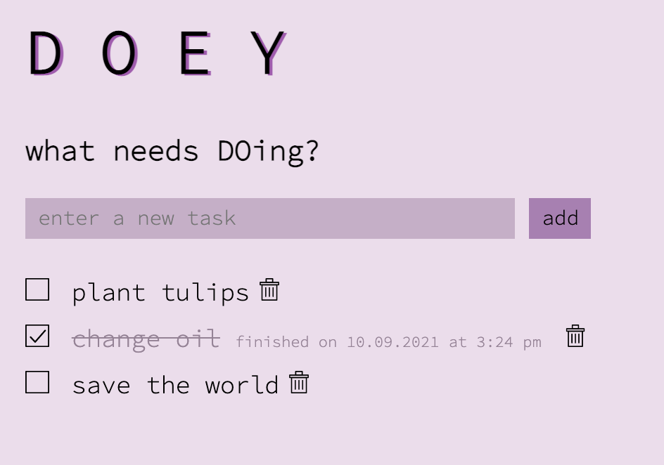

# DOEY

## Description

*Duraton: 3-day Sprint*

This To-Do List app lets you create tasks and mark them as completed. Task data is stored on a database, and updates can be made and are displayed on the DOM in a user-friendly minimalist interface. 

## Screenshot    

## Usage

* Enter a task in the input field: "send birthday card to grandma"
* Click "add"
  * The task is POSTed via ajax > express > SQL to the client > server > database and back. 
  * All tasks start out as "incomplete", showing an empty checkbox
* As you finish tasks, click the box to the left of that particular task
  * The task is updated so its "completion status" changes to "complete, with a GET via ajax > express > SQL to the client > server > database and back.
  * Completed tasks show a checked box image, their text is lightened and shown with linethrough - don't worry about it, it's done! :)
* To remove a task (whether it's been completed or not), click the trash icon to the right of that particular task. The DELETE request is sent to via ajax > express > SQL to the client > server > database and back. 
  * An alert is displayed - are you sure you want to delete? 
  * DOEY respects your privacy and does not store deleted tasks - rest easy knowing that once that hemorrhoid appointment is deleted, it's GONE.
* When the app loads, and when any changes are made to a task, Doey makes a GET request via ajax > express > SQL to the client > server > database and back, so that the updated list of tasks with the correct complete/incomplete status is displayed on the DOM.

## Built With

Javascript, jQuery, HTML, CSS, SweetAlert2, Node, Express, AJAX, PostgreSQL

## Acknowledgement 

Thanks to [Prime](https://github.com/PrimeAcademy/ "Prime") and our instructor [Dev](https://github.com/devjanaprime/ "Dev") for setting up the parameters of the assignment and providing inspiring stretch goals! Thank you also to my Ionian cohort buddies for hopping in and out of Study Hall to ruber ducky together.

